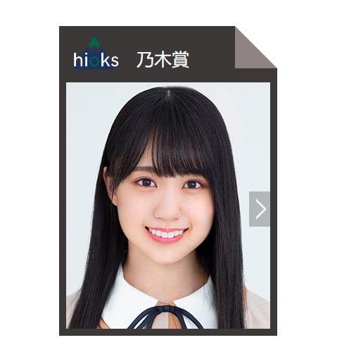
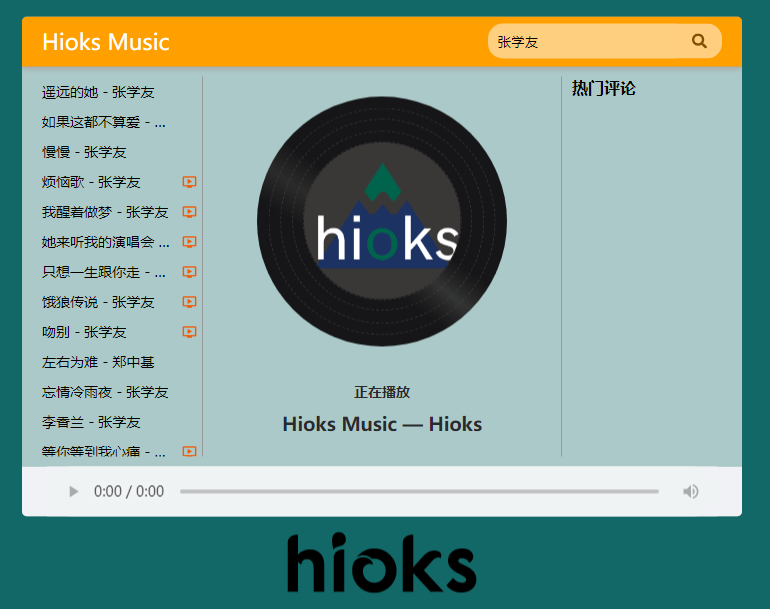

# 关于VueBasicProject
---
包含了三个入门Vue小项目
1. PicSwitch - 图片切换
   - 可实现点击左右键来切换图片
2. toDo - 简易toDo
   - 可输入回车来新增项
   - 可增删~~改查~~
   - 统计事项总数功能
   - 一键清空
3. Weather - 天气
   - 通过调用接口来获取天气
   - 快捷切换预设几个城市的天气情况
4. MusicPlayer - 网络音乐播放器
   - 通过调用接口获取音乐
   - 通过歌手名来返回获取到的音乐列表
   - 双击实现播放
   - 返回了mv的可用信息，~~播放功能~~未添加

### 1. PicSwitch
最终实现效果：

>当图片处于第一张时，左切换按钮自动隐藏，同理，当图片处于最后一张时，有切换按钮隐藏

创建一个数组来保存我们的图片，然后声明两个点击函数`pre(), next()`来控制图片的切换，修改索引值来实现图片的切换
用到的vue方法有：
- `v-on`绑定点击事件函数
- `v-bind`来修改``的属性`:src="imgArr[index]`
- `v-show`来控制切换按钮的隐藏与显示

### 2. toDo
最终实现效果：

>实现了基本的toDo List的功能，功能还不完善，数据未存储为本地数据，刷新页面后会初始化，数据重置

- 创建了一个数组对象来保存事项的值，利用`v-for`方法来生成列表数据；
- 每一次输入内容后借助`v-on.enter`来回车获取数据，并将该值`push`到数组中，
- 统计`v-text` 返回数组长度
- 清空列表是直接给列表赋值一个空数组

### 3. Weather
最终实现效果：

>返回最近5天的天气情况，实现回车查询，快捷切换绑定的预设城市天气情况

- 调用接口：`http://www.tianqiapi.com/api?version=v9&appid=YOUR_APPID&appsecret=YOUR_APPSECRET&city=`
  - 该接口免费使用，但需要注册，可自行上官网注册，将注册后得到的`appid`和`appsecret`替换到上面的接口链接中就可使用
  - 需要提供一个`city`城市名参数来返回该城市的天气情况结果，更多参数方法可上该文档查询：[https://www.tianqiapi.com/index/doc](https://www.tianqiapi.com/index/doc)
- 使用`v-model`方法双向绑定数据

### 4. MusicPlayer
最终实现效果：

1. 歌曲搜索
	- 按下回车(v-on.enter)
	- 查询数据(axios接口v-model)
	- 渲染数据(v-for数组that)
	- 请求地址: `https://autumnfish.cn/search`	`prop: keywords`

2. 歌曲播放
	- 点击播放(v-on)
	- 歌曲地址获取(song's id)
	- 歌曲地址设置(v-bind)
	- 请求地址：`https://autumnfish.cn/song/url` `prop: id`

3. 歌曲封面
	- 请求地址：`https://autumnfish.cn/song/detail` `prop: ids`

4. 歌曲评论
	- 请求地址：`https://autumnfish.cn/comment/hot`	`prop: {id}&type=0`

5. 播放动画
	- 监听音乐播放(v-on play)
	- 监听音乐暂停(v-on pause)
	- 操纵类名(v-bind 对象)

6. ~~MV播放~~ 后续改进(if...)
	- mv图标显示(v-if)
	- mv地址获取
	- 遮罩层
	- mv地址设置
	- 请求地址：`https://autumnfish.cn/mv/url`	`prop: id(mvid)`